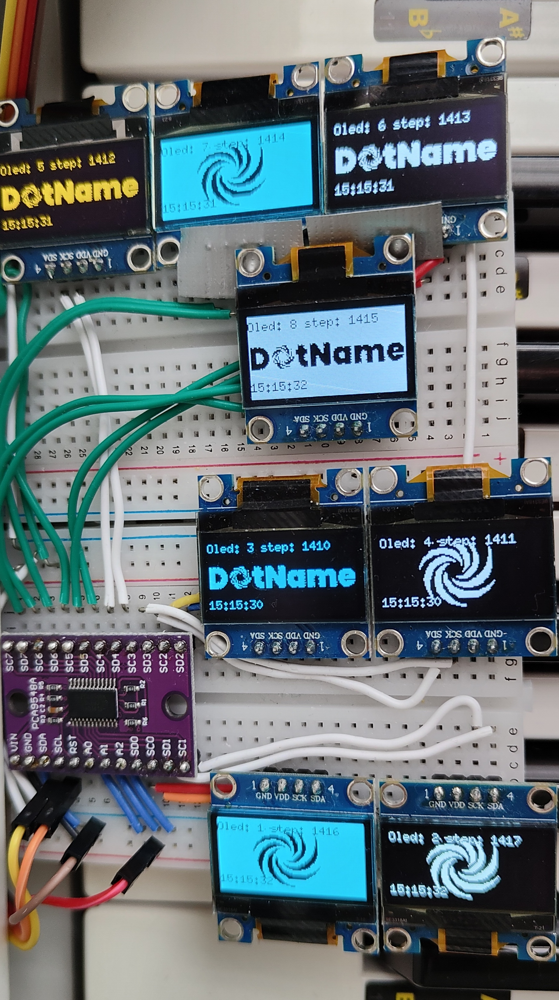

<!---

-->

# Multi Oled

This example illustrates how to use the **TCA9548A** multiplexer to drive up to eight **SSD1306** OLED displays on a Raspberry Pi platform (aarch64). Remote development is enabled through the ms-vscode-remote.remote-ssh extension, which allows direct access to a bare-metal Raspberry Pi 4. Note that the project employs an older version (14) of clang-format due to PiOS limitations.

# Reusability in another projects

This project is a library accompanied by an executable file. You can use the library in your own project.

[CMake compatible (CPM.cmake, FetchContent, or add_subdirectory).](https://github.com/tomasmark79/DotNameCppFree?tab=readme-ov-file#reusability-in-another-projects)

## Standalone Example

## Standalone Usage
## References

[u8g2 library](https://github.com/olikraus/u8g2)

---

**[DotName C++ Template](https://github.com/tomasmark79/DotNameCppFree)** – Kickstart your next project with this CMake template. ✨ It features a well-structured layout, integration of modern C++ standards, and a focus on cross-platform compatibility. Ideal for both beginners and experienced developers. 💻

## License

MIT License  
Copyright (c) 2024-2025 Tomáš Mark

[👆🏻](#index)